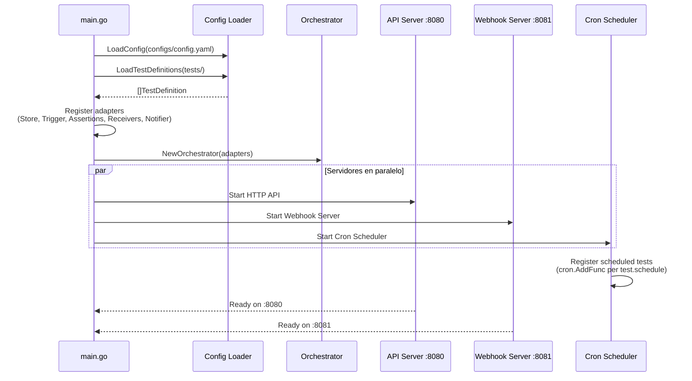
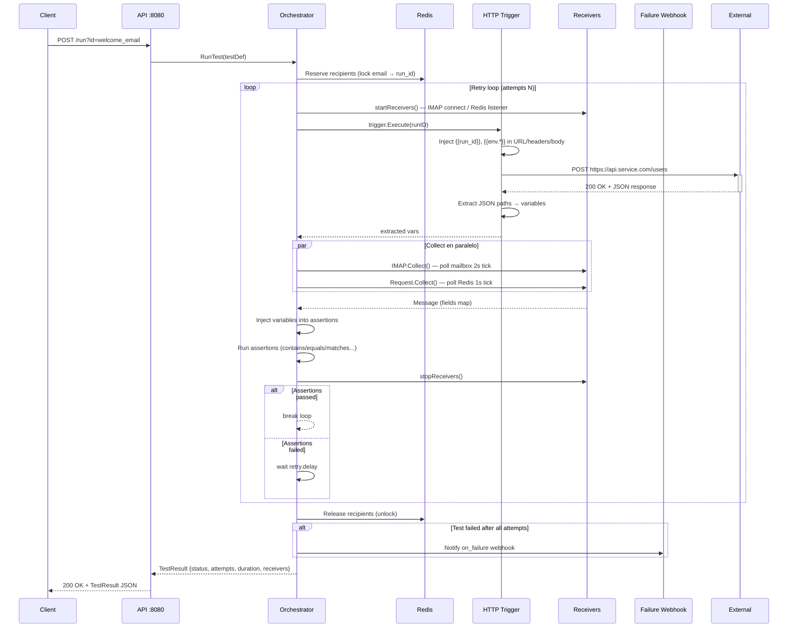
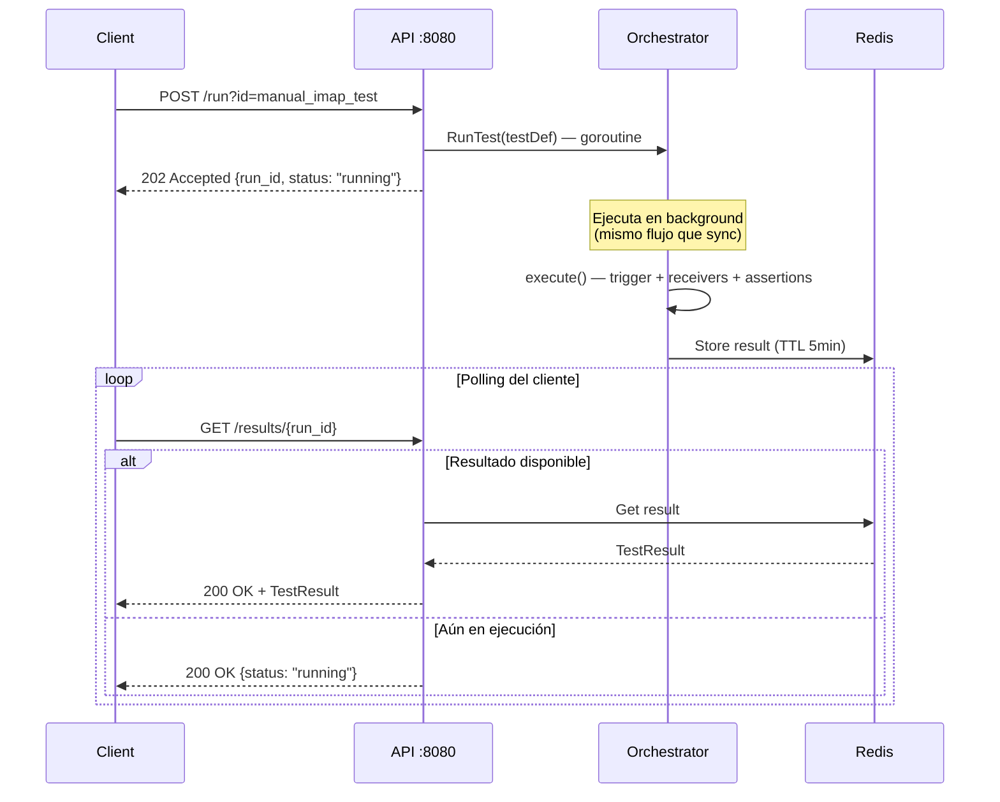
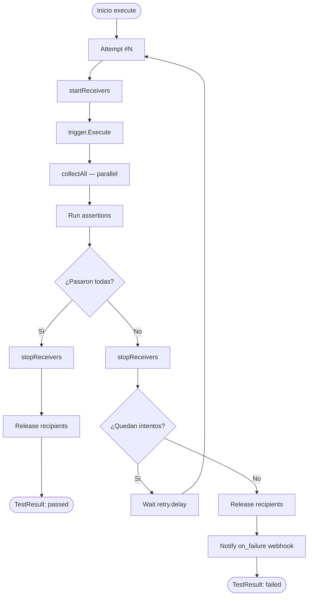
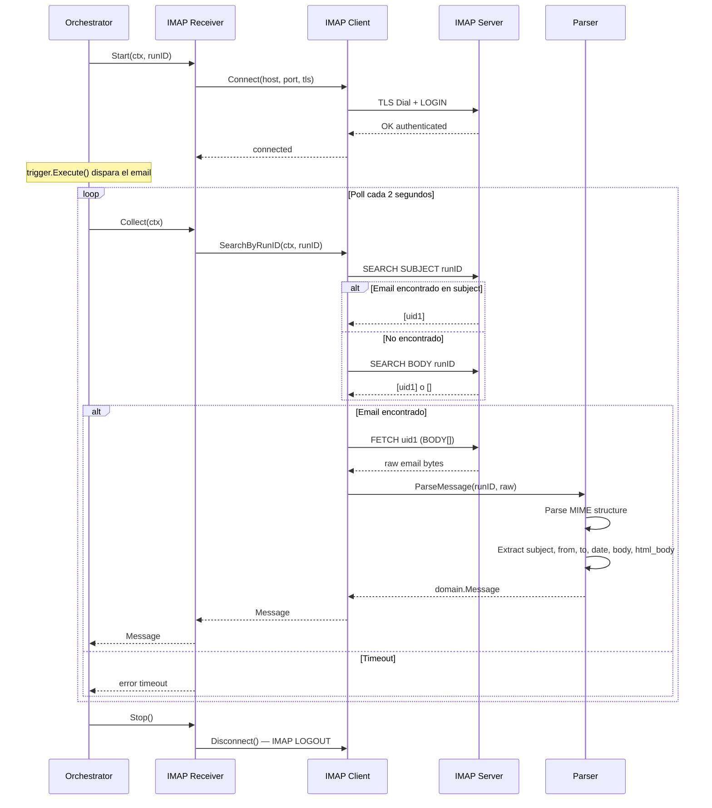
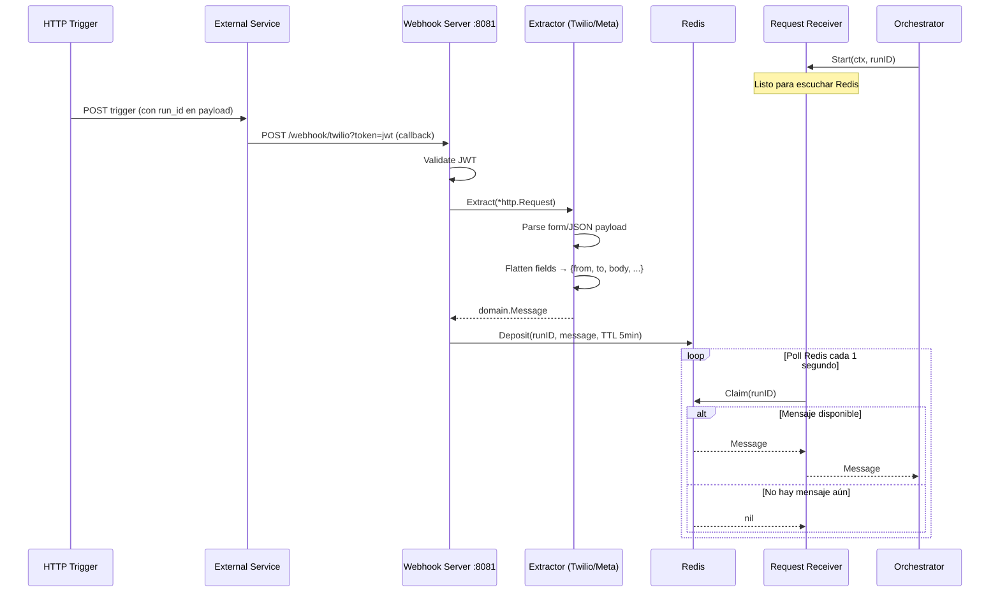
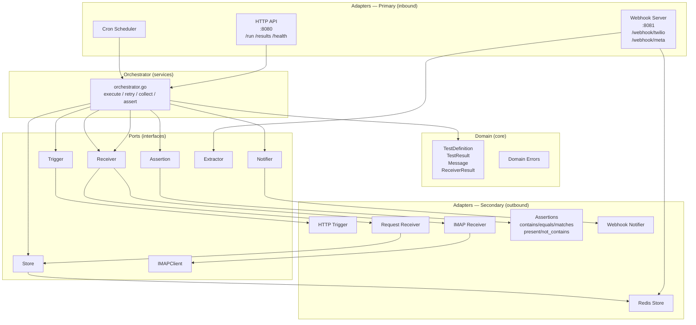

# E2E Framework — Overview

Framework de testing E2E basado en configuración YAML. No se escribe código de test — se define un `.yaml`, el servicio lo carga y lo ejecuta. Escrito en Go con arquitectura hexagonal (ports & adapters).

---

## ¿Qué hace?

1. Carga definiciones de test desde `tests/*.yaml` al arrancar. En un futuro cercano cargara los test de otro repo.
2. Permite lanzar tests bajo demanda a traves de HTTP o programando el test con un cron.
3. Dispara un HTTP trigger (la acción a testear)
4. Espera a la comprobacion del receiver (email IMAP, webhook...)
5. Valida los mensajes recibidos con assertions declarativas
6. Reintenta automáticamente si falla
7. Notifica por webhook si el test sigue fallando tras todos los intentoss

---

## Trabajar con YAML (sin tocar código)

### Flujo de trabajo

```
1. Crear/editar archivo en tests/mi_test.yaml
2. Reiniciar el servicio (o desplegar)
3. Ejecutar: POST /run?id=mi_test
4. Ver resultado: GET /results/{run_id}
```

Para tests programados, añadir `schedule: "*/5 * * * *"` y el scheduler los registra automáticamente.

### Anatomía del YAML

| Campo | Descripción |
|-------|-------------|
| `id` | Identificador único del test |
| `description` | Descripción legible |
| `enabled` | `true/false` — desactiva sin borrar |
| `async` | `false` → respuesta 200 + resultado; `true` → 202 + polling |
| `schedule` | Cron expression para ejecución programada |
| `retry.attempts` | Número total de intentos (incluyendo el primero) |
| `retry.delay` | Espera entre intentos (`5s`, `1m`, etc.) |
| `trigger` | Request HTTP que inicia el flujo (method, url, headers, body) |
| `trigger.extract` | JSON paths del response para extraer variables |
| `receivers[]` | Lista de canales a escuchar (`imap`, `request`) |
| `receivers[].assertions[]` | Validaciones sobre los mensajes recibidos |
| `on_failure.webhook` | Webhook de alerta si el test falla |

### Variables dinámicas

```yaml
# Disponibles en: trigger body/headers/url, receiver options, assertion values, on_failure body
{{run_id}}              # UUID único por ejecución — correlaciona trigger con mensaje recibido
{{env.NOMBRE_VAR}}      # Variable de entorno
{{variable_extraida}}   # Valor extraído del response del trigger via trigger.extract
{{test_id}}             # ID del test (disponible en on_failure)
{{error}}               # Mensaje de error (disponible en on_failure)
```

### Ejemplo completo

```yaml
version: "1"
id: welcome_email
description: "Verifica que se envía email de bienvenida tras registro."

schedule: "*/5 * * * *"
enabled: true

retry:
  enabled: true
  attempts: 3
  delay: 10s

trigger:
  method: POST
  url: "https://api.service.com/users"
  timeout: 10s
  headers:
    Content-Type: application/json
    Authorization: "Bearer {{env.API_TOKEN}}"
  body:
    email: "test@domain.com"
    message_id: "{{run_id}}"
  extract:
    user_id: "data.id"           # Extrae response.data.id como {{user_id}}

receivers:
  - type: imap
    timeout: 60s
    options:
      host: "{{env.IMAP_HOST}}"
      port: "{{env.IMAP_PORT}}"
      username: "{{env.IMAP_USERNAME}}"
      password: "{{env.IMAP_PASSWORD}}"
      mailbox: INBOX
      tls: true
    assertions:
      - type: contains
        field: subject
        value: "Welcome"
      - type: equals
        field: from
        value: "noreply@company.com"
      - type: contains
        field: body
        value: "{{run_id}}"

on_failure:
  webhook:
    url: "https://alerts.company.com/hook"
    method: POST
    body:
      test_id: "{{test_id}}"
      run_id: "{{run_id}}"
      error: "{{error}}"
```

---

## Assertions disponibles

| Tipo | Comportamiento |
|------|---------------|
| `contains` | El campo contiene el substring esperado |
| `equals` | El campo es exactamente igual al valor esperado |
| `matches` | El campo hace match con el regex en `value` |
| `present` | El campo existe y no está vacío |
| `not_contains` | El campo NO contiene el substring |

Campos disponibles en emails: `subject`, `from`, `to`, `date`, `body`, `html_body`  
Campos en webhooks: dependen del extractor (ej. Twilio: `from`, `to`, `body`)

---

## Flujos E2E — Diagramas

### 1. Bootstrap del servicio



---

### 2. Ejecución sync (async: false)



---

### 3. Ejecución async (async: true)



---

### 4. Flujo de retry



---

### 5. Receiver IMAP



---

### 6. Receiver Request (Webhook)



---

### 7. Arquitectura hexagonal



---

## API Endpoints

| Método | Path | Auth | Descripción |
|--------|------|------|-------------|
| `GET` | `/health` | No | Liveness check |
| `POST` | `/run?id={test_id}` | Bearer token | Ejecutar test |
| `GET` | `/results` | Bearer token | Últimos 100 resultados |
| `GET` | `/results/{run_id}` | Bearer token | Polling resultado async |
| `GET` | `/swagger/` | Bearer token | Docs interactivos |
| `POST` | `/webhook/{provider}` | JWT query param | Recibir webhook |

---

## Cosas Interesantes

### Correlación sin acoplamiento con `{{run_id}}`
Cada ejecución genera un UUID único inyectado en el trigger payload. El sistema recibe mensajes del mundo exterior y busca ese UUID — sin que el servicio bajo test tenga que hacer nada especial. Solo necesita propagar el `run_id` en el mensaje de salida (email, webhook, SMS).

### Recipients reservados con Redis lock
Si dos tests usan el mismo email receptor, Redis los serializa. No hay race conditions entre runs concurrentes sobre el mismo buzón IMAP.

### `options` map por receiver
La configuración de conexión (host, puerto, credenciales) vive en el YAML, no en `configs/config.yaml`. Un mismo tipo de receiver puede conectarse a cuentas distintas por test. Añadir un receiver nuevo no requiere cambios en config global.

### Extractor pattern
El parsing del webhook (Twilio, Meta, etc.) está separado del receiver. Añadir un proveedor nuevo = crear un `Extractor` nuevo + registrarlo. El `Request Receiver` no cambia.

### Async + Redis TTL = polling sin DB
`async: true` devuelve 202 inmediatamente. El resultado se guarda en Redis con TTL de 5 min. Stateless polling — sin tabla de resultados persistente.

### Añadir un receiver nuevo en 5 pasos
Ver `CONTRIBUTING.md`:
1. Crear `internal/adapters/secondary/receiver/{canal}/receiver.go`
2. Implementar interfaz `ports.Receiver` (Start, Collect, Stop)
3. Añadir config de infraestructura en `configs/config.yaml` si aplica
4. Registrar en `cmd/server/main.go`
5. Usar `type: {canal}` en YAML

### Auth configurable
`auth.enabled: false` en config desactiva la autenticación — útil en local. El webhook server usa JWT por query param (`?token=...`) compatible con Twilio y Meta que no soportan headers custom en callbacks.

### Swagger autogenerado
`GET /swagger/` expone docs interactivos generados desde anotaciones en el código. No hay que mantener un spec manual.
