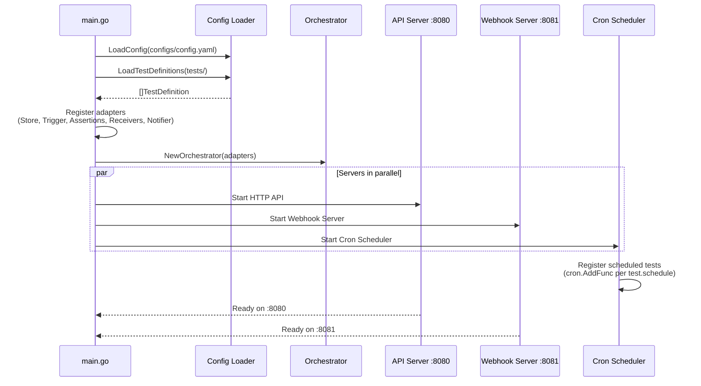
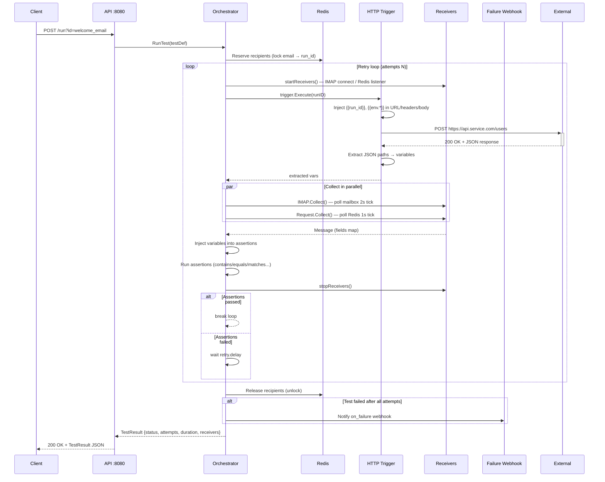
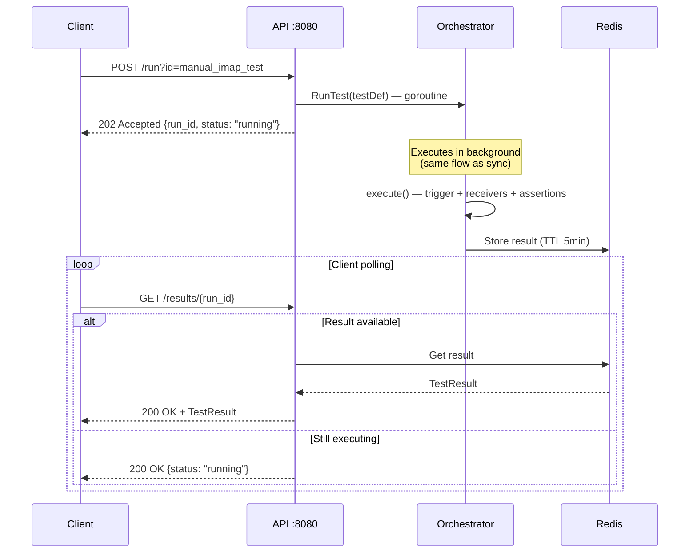
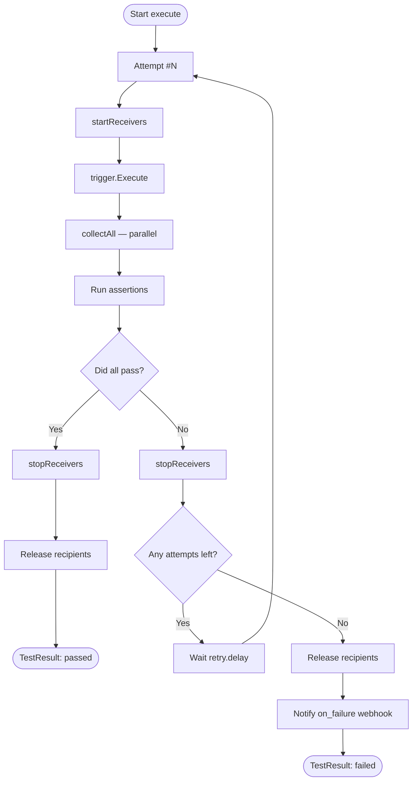
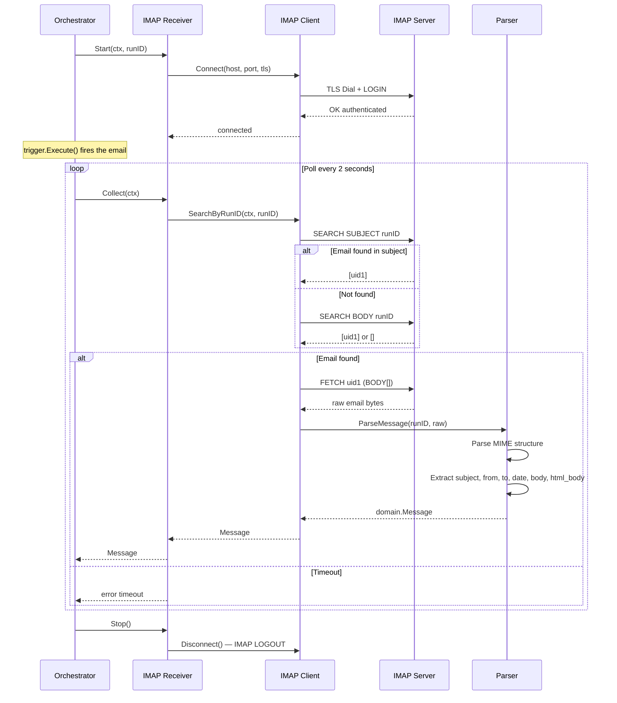
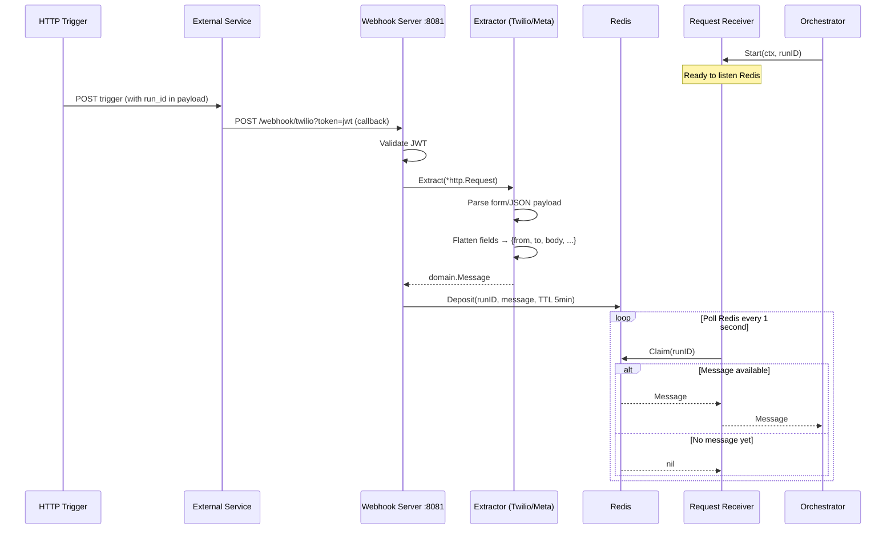
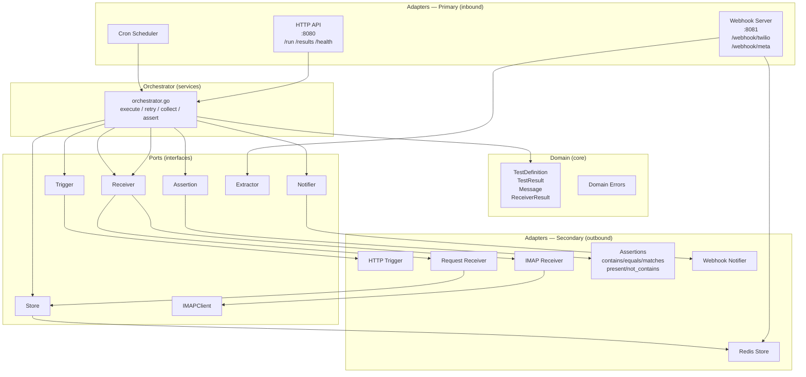

# E2E Framework — Overview

YAML-based E2E testing framework. No test code to write — define a `.yaml`, the service loads and executes it. Written in Go with hexagonal architecture (ports & adapters).

---

## What does it do?

1. Loads test definitions from `tests/*.yaml` on startup. In the near future, it will load tests from another repository.
2. It allows you to launch tests on demand via HTTP or by scheduling the test with a cron job.
3. Fires an HTTP trigger (the action being tested)
4. Wait for receiver verification (email IMAP, webhook...)
5. Validates received messages with declarative assertions
6. Automatically retries on failure
7. Notifies via webhook if the test fails after all retry attempts

---

## Working with YAML (without touching code)

### Workflow

```
1. Create/edit file in tests/my_test.yaml
2. Restart the service (or deploy)
3. Execute: POST /run?id=my_test
4. View result: GET /results/{run_id}
```

For scheduled tests, add `schedule: "*/5 * * * *"` and the scheduler registers them automatically.

### YAML Anatomy

| Field | Description |
|-------|-------------|
| `id` | Unique test identifier |
| `description` | Human-readable description |
| `enabled` | `true/false` — disable without deleting |
| `async` | `false` → 200 response + result; `true` → 202 + polling |
| `schedule` | Cron expression for scheduled execution |
| `retry.attempts` | Total number of attempts (including first) |
| `retry.delay` | Wait between attempts (`5s`, `1m`, etc.) |
| `trigger` | HTTP request that starts the flow (method, url, headers, body) |
| `trigger.extract` | JSON paths from response to extract variables |
| `receivers[]` | List of channels to listen on (`imap`, `request`) |
| `receivers[].assertions[]` | Validations on received messages |
| `on_failure.webhook` | Alert webhook if test fails |

### Dynamic Variables

```yaml
# Available in: trigger body/headers/url, receiver options, assertion values, on_failure body
{{run_id}}              # Unique UUID per execution — correlates trigger with received message
{{env.VAR_NAME}}        # Environment variable
{{extracted_variable}}  # Value extracted from trigger response via trigger.extract
{{test_id}}             # Test ID (available in on_failure)
{{error}}               # Error message (available in on_failure)
```

### Complete Example

```yaml
version: "1"
id: welcome_email
description: "Verify welcome email is sent after registration."

schedule: "*/5 * * * *"
enabled: true

retry:
  enabled: true
  attempts: 3
  delay: 10s

trigger:
  method: POST
  url: "https://api.service.com/users"
  timeout: 10s
  headers:
    Content-Type: application/json
    Authorization: "Bearer {{env.API_TOKEN}}"
  body:
    email: "test@domain.com"
    message_id: "{{run_id}}"
  extract:
    user_id: "data.id"           # Extracts response.data.id as {{user_id}}

receivers:
  - type: imap
    timeout: 60s
    options:
      host: "{{env.IMAP_HOST}}"
      port: "{{env.IMAP_PORT}}"
      username: "{{env.IMAP_USERNAME}}"
      password: "{{env.IMAP_PASSWORD}}"
      mailbox: INBOX
      tls: true
    assertions:
      - type: contains
        field: subject
        value: "Welcome"
      - type: equals
        field: from
        value: "noreply@company.com"
      - type: contains
        field: body
        value: "{{run_id}}"

on_failure:
  webhook:
    url: "https://alerts.company.com/hook"
    method: POST
    body:
      test_id: "{{test_id}}"
      run_id: "{{run_id}}"
      error: "{{error}}"
```

---

## Available Assertions

| Type | Behavior |
|------|----------|
| `contains` | Field contains the expected substring |
| `equals` | Field is exactly equal to the expected value |
| `matches` | Field matches the regex in `value` |
| `present` | Field exists and is not empty |
| `not_contains` | Field does NOT contain the substring |

Available fields in emails: `subject`, `from`, `to`, `date`, `body`, `html_body`  
Fields in webhooks: depends on the extractor (e.g. Twilio: `from`, `to`, `body`)

---

## E2E Flows — Diagrams

### 1. Service Bootstrap



---

### 2. Sync Execution (async: false)



---

### 3. Async Execution (async: true)



---

### 4. Retry Flow



---

### 5. IMAP Receiver



---

### 6. Request Receiver (Webhook)



---

### 7. Hexagonal Architecture



---

## API Endpoints

| Method | Path | Auth | Description |
|--------|------|------|-------------|
| `GET` | `/health` | No | Liveness check |
| `POST` | `/run?id={test_id}` | Bearer token | Execute test |
| `GET` | `/results` | Bearer token | Last 100 results |
| `GET` | `/results/{run_id}` | Bearer token | Poll async result |
| `GET` | `/swagger/` | Bearer token | Interactive docs |
| `POST` | `/webhook/{provider}` | JWT query param | Receive webhook |

---

## Interesting Things

### Correlation without coupling via `{{run_id}}`
Each execution generates a unique UUID injected into the trigger payload. The system receives messages from the outside world and searches for that UUID — without the service under test having to do anything special. It only needs to propagate the `run_id` in the outgoing message (email, webhook, SMS).

### Reserved recipients with Redis lock
If two tests use the same receiver email, Redis serializes them. No race conditions between concurrent runs on the same IMAP mailbox.

### `options` map per receiver
Connection configuration (host, port, credentials) lives in the YAML, not in `configs/config.yaml`. The same receiver type can connect to different accounts per test. Adding a new receiver doesn't require global config changes.

### Extractor pattern
Webhook parsing (Twilio, Meta, etc.) is separated from the receiver. Adding a new provider = create a new `Extractor` + register it. The `Request Receiver` doesn't change.

### Async + Redis TTL = polling without DB
`async: true` returns 202 immediately. The result is stored in Redis with a 5-minute TTL. Stateless polling — no persistent results table.

### Add a new receiver in 5 steps
See `CONTRIBUTING.md`:
1. Create `internal/adapters/secondary/receiver/{channel}/receiver.go`
2. Implement `ports.Receiver` interface (Start, Collect, Stop)
3. Add infrastructure config in `configs/config.yaml` if applicable
4. Register in `cmd/server/main.go`
5. Use `type: {channel}` in YAML

### Configurable Auth
`auth.enabled: false` in config disables authentication — useful locally. The webhook server uses JWT via query param (`?token=...`) compatible with Twilio and Meta which don't support custom headers in callbacks.

### Autogenerated Swagger
`GET /swagger/` exposes interactive docs generated from annotations in the code. No need to maintain a manual spec.
